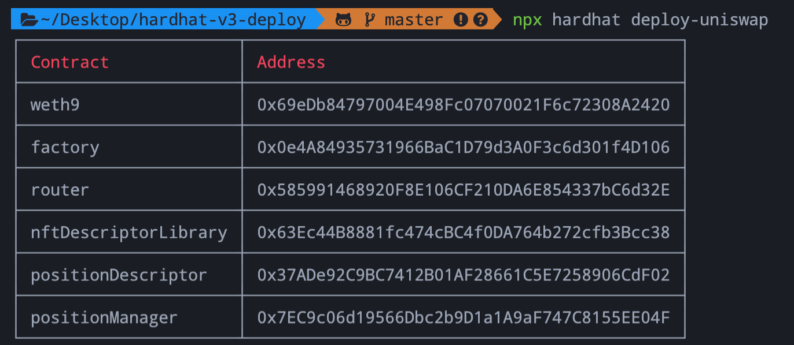

# uniswap-v3-hardhat-deploy

Deploy Uniswap V3 contracts for development in testnet.

## Installation

```sh
yarn install
```

## Command and parameters
Use `npx hardhat` and you should see:

```
AVAILABLE TASKS:
  check                 Check whatever you need
  clean                 Clears the cache and deletes all artifacts
  compile               Compiles the entire project, building all artifacts
  console               Opens a hardhat console
  deploy-uniswap        Deploys Uniswap V3 contracts
  flatten               Flattens and prints contracts and their dependencies
  help                  Prints this message
  node                  Starts a JSON-RPC server on top of Hardhat Network
  run                   Runs a user-defined script after compiling the project
  test                  Runs mocha tests
```

## Deploy

```sh
npx hardhat deploy-uniswap
```
</img>
